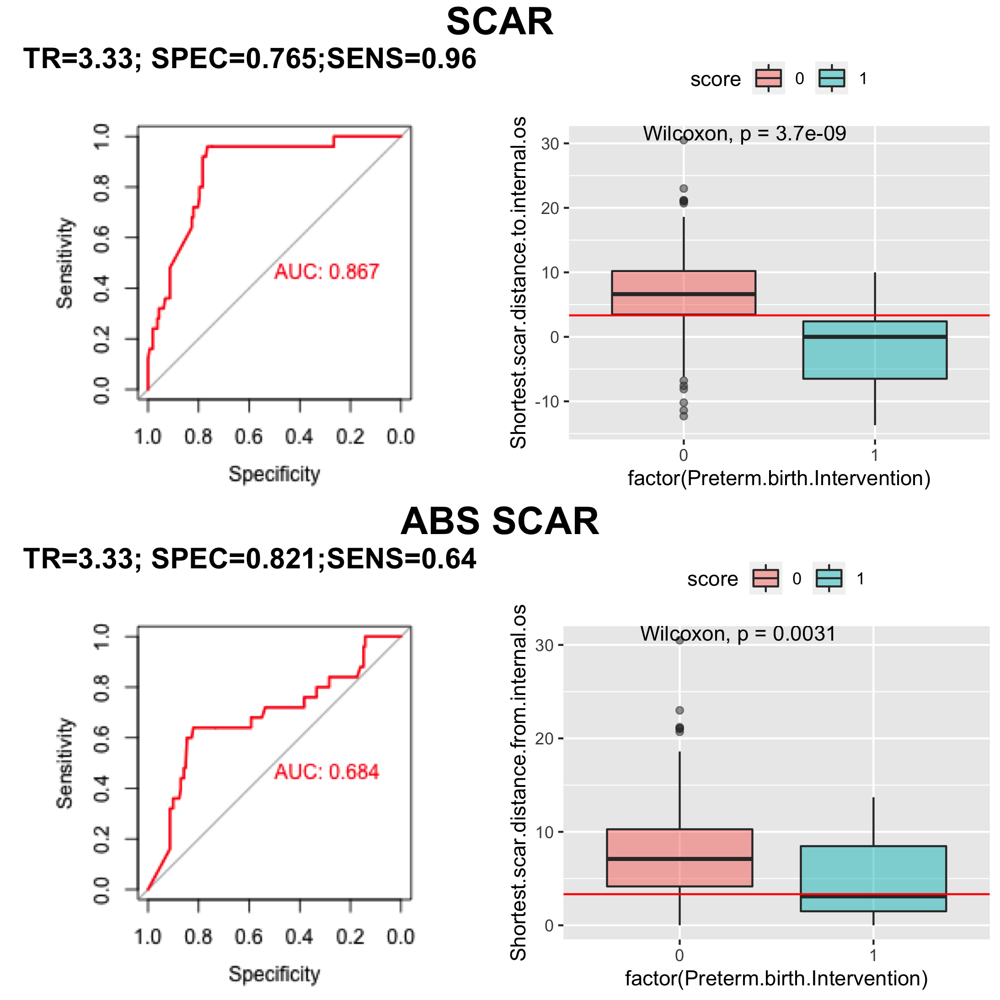
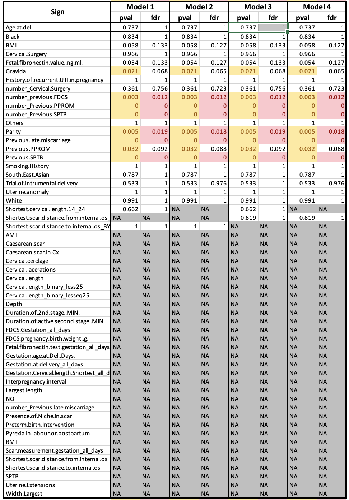
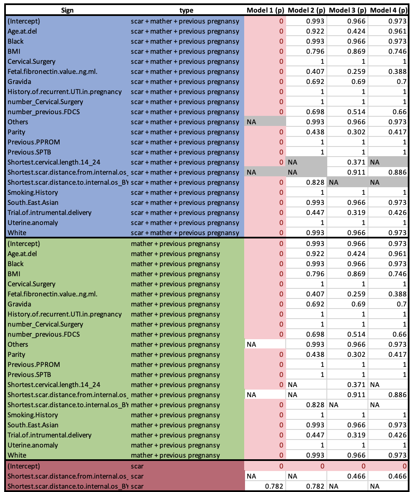
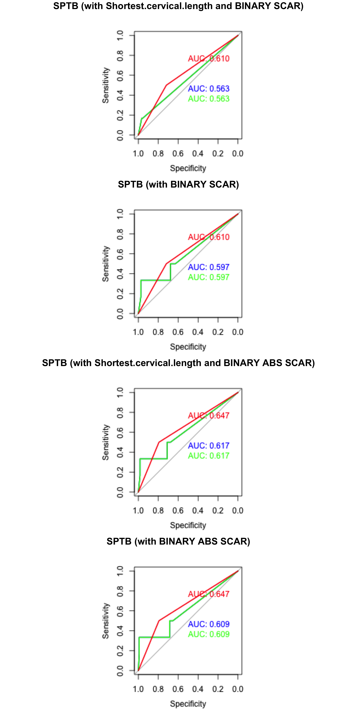

- Found the best threshold for SCAR (or for ABS SCAR) as a separator for samples with PBI = 1 and PBI = 0;

- Removed samples with PBI = 1 from data and applied the best threshold to create a binary (categorical) sign and added it to models.

  
MODELS INFO 

**1** SAMPLES=127: CASES/CONTROLS: 6/121; FEATURES: Excluded (7):Uterine.Extensions,Cervical.lacerations,Pyrexia.in.labour.or.postpartum,Interpregnancy.interval,FDCS.pregnancy.birth.weight..g.,Duration.of.2nd.stage..MIN.,Duration.of.active.second.stage..MIN.; FEATURES: With NA (0):; FEATURES: Good (24):White,Black,South.East.Asian,Others,Smoking.History,Previous.SPTB,Previous.PPROM,Previous.late.miscarriage,Cervical.Surgery,Uterine.anomaly,History.of.recurrent.UTI.in.pregnancy,Trial.of.intrumental.delivery,Shortest.scar.distance.to.internal.os_BY_PBI,BMI,Age.at.del,Gravida,Parity,number_Previous.SPTB,number_Previous.PPROM,number_Previous.late.miscarriage,number_Cervical.Surgery,number_previous.FDCS,Fetal.fibronectin.value..ng.ml.,Shortest.cervical.length.14_24
**2** SAMPLES=127: CASES/CONTROLS: 6/121; FEATURES: Excluded (7):Uterine.Extensions,Cervical.lacerations,Pyrexia.in.labour.or.postpartum,Interpregnancy.interval,FDCS.pregnancy.birth.weight..g.,Duration.of.2nd.stage..MIN.,Duration.of.active.second.stage..MIN.; FEATURES: With NA (0):; FEATURES: Good (23):White,Black,South.East.Asian,Others,Smoking.History,Previous.SPTB,Previous.PPROM,Previous.late.miscarriage,Cervical.Surgery,Uterine.anomaly,History.of.recurrent.UTI.in.pregnancy,Trial.of.intrumental.delivery,Shortest.scar.distance.to.internal.os_BY_PBI,BMI,Age.at.del,Gravida,Parity,number_Previous.SPTB,number_Previous.PPROM,number_Previous.late.miscarriage,number_Cervical.Surgery,number_previous.FDCS,Fetal.fibronectin.value..ng.ml.
**3** SAMPLES=127: CASES/CONTROLS: 6/121; FEATURES: Excluded (7):Uterine.Extensions,Cervical.lacerations,Pyrexia.in.labour.or.postpartum,Interpregnancy.interval,FDCS.pregnancy.birth.weight..g.,Duration.of.2nd.stage..MIN.,Duration.of.active.second.stage..MIN.; FEATURES: With NA (0):; FEATURES: Good (24):White,Black,South.East.Asian,Others,Smoking.History,Previous.SPTB,Previous.PPROM,Previous.late.miscarriage,Cervical.Surgery,Uterine.anomaly,History.of.recurrent.UTI.in.pregnancy,Trial.of.intrumental.delivery,Shortest.scar.distance.from.internal.os_BY_PBI,BMI,Age.at.del,Gravida,Parity,number_Previous.SPTB,number_Previous.PPROM,number_Previous.late.miscarriage,number_Cervical.Surgery,number_previous.FDCS,Fetal.fibronectin.value..ng.ml.,Shortest.cervical.length.14_24
**4** SAMPLES=127: CASES/CONTROLS: 6/121; FEATURES: Excluded (7):Uterine.Extensions,Cervical.lacerations,Pyrexia.in.labour.or.postpartum,Interpregnancy.interval,FDCS.pregnancy.birth.weight..g.,Duration.of.2nd.stage..MIN.,Duration.of.active.second.stage..MIN.; FEATURES: With NA (0):; FEATURES: Good (23):White,Black,South.East.Asian,Others,Smoking.History,Previous.SPTB,Previous.PPROM,Previous.late.miscarriage,Cervical.Surgery,Uterine.anomaly,History.of.recurrent.UTI.in.pregnancy,Trial.of.intrumental.delivery,Shortest.scar.distance.from.internal.os_BY_PBI,BMI,Age.at.del,Gravida,Parity,number_Previous.SPTB,number_Previous.PPROM,number_Previous.late.miscarriage,number_Cervical.Surgery,number_previous.FDCS,Fetal.fibronectin.value..ng.ml.

# Models

1. SPTB (with Shortest.cervical.length measurement and BINARY SCAR)
2. SPTB (with BINARY SCAR)
3. SPTB (with Shortest.cervical.length measurement and BINARY ABS SCAR)
4. SPTB (with BINARY ABS SCAR)

# (One-parametr) Comparison between the Control and Case groups was by chi- square test for categorical variables and Wilcoxon test for continuous variables

# (Multi-parametr) logistic regression (significance of coefficients)

# Results
## Model
- GLM

## Types of building (LOOCV - pessimistic AUC)
- *LOOCV* (The purpose of this check is to make sure that the chosen method of the model does not lead to its overfitting and allows it to be applied to other data):
1. Each point is excluded from the dataset
2. The model is built using the remaining points
3. Using the constructed model, the thrown out point receives a prediction (the probability of belonging to a class of cases)
4. The final ROC is based on these predictions

## Colors
-  `(scar) parameters`
-  `(mather + previous pregnancy) parameters`
-  `(scar) + (mather + previous pregnancy) parameters`

## AUCs

