[old page](old.md)

Models

  
1. SPTB

    (the same as the previous one)
   
  <pre>
| model                              | N   | cases | controls | features                                                                                                                                                                                                                                                                                                                                                                                                                                                                                                                                                                                                                                    | number |
|------------------------------------|-----|-------|----------|---------------------------------------------------------------------------------------------------------------------------------------------------------------------------------------------------------------------------------------------------------------------------------------------------------------------------------------------------------------------------------------------------------------------------------------------------------------------------------------------------------------------------------------------------------------------------------------------------------------------------------------------|--------|
| scar + mather + previous pregnancy | 166 | 8     | 158      | White, Black, South.East.Asian, Others, Smoking.History, Previous.SPTB, Previous.PPROM,  Previous.late.miscarriage, Cervical.Surgery, Uterine.anomaly, History.of.recurrent.UTI.in.pregnancy,  Trial.of.intrumental.delivery, BMI, Age.at.del, Gravida, Parity, number_Previous.SPTB, number_Previous.PPROM,  number_Previous.late.miscarriage, number_Cervical.Surgery, number_previous.FDCS,  Shortest.scar.distance.to.internal.os, Shortest.scar.distance.from.internal.os                                                                                                                                                              | 1      |
| mather + previous pregnancy        | 180 | 8     | 172      | White, Black, South.East.Asian, Others, Smoking.History, Previous.SPTB, Previous.PPROM,  Previous.late.miscarriage, Cervical.Surgery, Uterine.anomaly, History.of.recurrent.UTI.in.pregnancy,  Trial.of.intrumental.delivery, BMI, Age.at.del, Gravida, Parity, number_Previous.SPTB, number_Previous.PPROM,  number_Previous.late.miscarriage, number_Cervical.Surgery, number_previous.FDCS                                                                                                                                                                                                                                               | 1      |
| scar                               | 177 | 8     | 169      | Shortest.scar.distance.to.internal.os, Shortest.scar.distance.from.internal.os                                                                                                                                                                                                                                                                                                                                                                                                                                                                                                                                                              | 1      |
  </pre>

  
2. SPTB: excluded samples PBI == 1 and CL < 0.25 == 1 

    (the same as the previous one)
   
  <pre>
| model                              | N   | cases | controls | features                                                                                                                                                                                                                                                                                                                                                                                                                                                                                                                                                                                                                                    | number |
|------------------------------------|-----|-------|----------|---------------------------------------------------------------------------------------------------------------------------------------------------------------------------------------------------------------------------------------------------------------------------------------------------------------------------------------------------------------------------------------------------------------------------------------------------------------------------------------------------------------------------------------------------------------------------------------------------------------------------------------------|--------|
| scar + mather + previous pregnancy | 145 | 6     | 139      | White, Black, South.East.Asian, Others, Smoking.History, Previous.SPTB, Previous.PPROM,  Previous.late.miscarriage, Cervical.Surgery, Uterine.anomaly, History.of.recurrent.UTI.in.pregnancy,  Trial.of.intrumental.delivery, BMI, Age.at.del, Gravida, Parity, number_Previous.SPTB, number_Previous.PPROM,  number_Previous.late.miscarriage, number_Cervical.Surgery, number_previous.FDCS,  Shortest.scar.distance.to.internal.os, Shortest.scar.distance.from.internal.os                                                                                                                                                              | 2      |
| mather + previous pregnancy        | 157 | 6     | 151      | White, Black, South.East.Asian, Others, Smoking.History, Previous.SPTB, Previous.PPROM,  Previous.late.miscarriage, Cervical.Surgery, Uterine.anomaly, History.of.recurrent.UTI.in.pregnancy,  Trial.of.intrumental.delivery, BMI, Age.at.del, Gravida, Parity, number_Previous.SPTB, number_Previous.PPROM,  number_Previous.late.miscarriage, number_Cervical.Surgery, number_previous.FDCS                                                                                                                                                                                                                                               | 2      |
| scar                               | 153 | 6     | 147      | Shortest.scar.distance.to.internal.os, Shortest.scar.distance.from.internal.os                                                                                                                                                                                                                                                                                                                                                                                                                                                                                                                                                              | 2      |
  </pre>

  
3. SPTB or PBI

    (the same as the previous one)
   
  <pre>
| model                              | N   | cases | controls | features                                                                                                                                                                                                                                                                                                                                                                                                                                                                                                                                                                                                                                    | number |
|------------------------------------|-----|-------|----------|---------------------------------------------------------------------------------------------------------------------------------------------------------------------------------------------------------------------------------------------------------------------------------------------------------------------------------------------------------------------------------------------------------------------------------------------------------------------------------------------------------------------------------------------------------------------------------------------------------------------------------------------|--------|
| scar + mather + previous pregnancy | 144 | 22    | 122      | White, Black, South.East.Asian, Others, Smoking.History, Previous.SPTB, Previous.PPROM,  Previous.late.miscarriage, Cervical.Surgery, Uterine.anomaly, History.of.recurrent.UTI.in.pregnancy,  Trial.of.intrumental.delivery, Uterine.Extensions, Cervical.lacerations, Pyrexia.in.labour.or.postpartum,  BMI, Age.at.del, Gravida, Parity, number_Previous.SPTB, number_Previous.PPROM, number_Previous.late.miscarriage,  number_Cervical.Surgery, number_previous.FDCS, FDCS.pregnancy.birth.weight..g.,  Shortest.scar.distance.to.internal.os, Shortest.scar.distance.from.internal.os                                                 | 3      |
| mather + previous pregnancy        | 155 | 23    | 132      | White, Black, South.East.Asian, Others, Smoking.History, Previous.SPTB, Previous.PPROM,  Previous.late.miscarriage, Cervical.Surgery, Uterine.anomaly, History.of.recurrent.UTI.in.pregnancy,  Trial.of.intrumental.delivery, Uterine.Extensions, Cervical.lacerations, Pyrexia.in.labour.or.postpartum,  BMI, Age.at.del, Gravida, Parity, number_Previous.SPTB, number_Previous.PPROM, number_Previous.late.miscarriage,  number_Cervical.Surgery, number_previous.FDCS, FDCS.pregnancy.birth.weight..g.                                                                                                                                  | 3      |
| scar                               | 177 | 29    | 148      | Shortest.scar.distance.to.internal.os, Shortest.scar.distance.from.internal.os                                                                                                                                                                                                                                                                                                                                                                                                                                                                                                                                                              | 3      |
  </pre>

  
4. SPTB or CL < 0.25

    (the same as the previous one)
   
  <pre>
| model                              | N   | cases | controls | features                                                                                                                                                                                                                                                                                                                                                                                                                                                                                                                                                                                                                                    | number |
|------------------------------------|-----|-------|----------|---------------------------------------------------------------------------------------------------------------------------------------------------------------------------------------------------------------------------------------------------------------------------------------------------------------------------------------------------------------------------------------------------------------------------------------------------------------------------------------------------------------------------------------------------------------------------------------------------------------------------------------------|--------|
| scar + mather + previous pregnancy | 144 | 19    | 125      | White, Black, South.East.Asian, Others, Smoking.History, Previous.SPTB, Previous.PPROM,  Previous.late.miscarriage, Cervical.Surgery, Uterine.anomaly, History.of.recurrent.UTI.in.pregnancy,  Trial.of.intrumental.delivery, Uterine.Extensions, Cervical.lacerations, Pyrexia.in.labour.or.postpartum,  BMI, Age.at.del, Gravida, Parity, number_Previous.SPTB, number_Previous.PPROM, number_Previous.late.miscarriage,  number_Cervical.Surgery, number_previous.FDCS, FDCS.pregnancy.birth.weight..g.,  Shortest.scar.distance.to.internal.os, Shortest.scar.distance.from.internal.os                                                 | 4      |
| mather + previous pregnancy        | 155 | 20    | 135      | White, Black, South.East.Asian, Others, Smoking.History, Previous.SPTB, Previous.PPROM,  Previous.late.miscarriage, Cervical.Surgery, Uterine.anomaly, History.of.recurrent.UTI.in.pregnancy,  Trial.of.intrumental.delivery, Uterine.Extensions, Cervical.lacerations, Pyrexia.in.labour.or.postpartum,  BMI, Age.at.del, Gravida, Parity, number_Previous.SPTB, number_Previous.PPROM, number_Previous.late.miscarriage,  number_Cervical.Surgery, number_previous.FDCS, FDCS.pregnancy.birth.weight..g.                                                                                                                                  | 4      |
| scar                               | 177 | 25    | 152      | Shortest.scar.distance.to.internal.os, Shortest.scar.distance.from.internal.os                                                                                                                                                                                                                                                                                                                                                                                                                                                                                                                                                              | 4      |
  </pre>

  
5. PBI

    (the same as the previous one)
   
  <pre>
| model                              | N   | cases | controls | features                                                                                                                                                                                                                                                                                                                                                                                                                                                                                                                                                                                                                                    | number |
|------------------------------------|-----|-------|----------|---------------------------------------------------------------------------------------------------------------------------------------------------------------------------------------------------------------------------------------------------------------------------------------------------------------------------------------------------------------------------------------------------------------------------------------------------------------------------------------------------------------------------------------------------------------------------------------------------------------------------------------------|--------|
| scar + mather + previous pregnancy | 144 | 20    | 124      | White, Black, South.East.Asian, Others, Smoking.History, Previous.SPTB, Previous.PPROM,  Previous.late.miscarriage, Cervical.Surgery, Uterine.anomaly, History.of.recurrent.UTI.in.pregnancy,  Trial.of.intrumental.delivery, Uterine.Extensions, Cervical.lacerations, Pyrexia.in.labour.or.postpartum,  BMI, Age.at.del, Gravida, Parity, number_Previous.SPTB, number_Previous.PPROM, number_Previous.late.miscarriage,  number_Cervical.Surgery, number_previous.FDCS, FDCS.pregnancy.birth.weight..g.,  Shortest.scar.distance.to.internal.os, Shortest.scar.distance.from.internal.os                                                 | 5      |
| mather + previous pregnancy        | 155 | 21    | 134      | White, Black, South.East.Asian, Others, Smoking.History, Previous.SPTB, Previous.PPROM,  Previous.late.miscarriage, Cervical.Surgery, Uterine.anomaly, History.of.recurrent.UTI.in.pregnancy,  Trial.of.intrumental.delivery, Uterine.Extensions, Cervical.lacerations, Pyrexia.in.labour.or.postpartum,  BMI, Age.at.del, Gravida, Parity, number_Previous.SPTB, number_Previous.PPROM, number_Previous.late.miscarriage,  number_Cervical.Surgery, number_previous.FDCS, FDCS.pregnancy.birth.weight..g.                                                                                                                                  | 5      |
| scar                               | 177 | 23    | 154      | Shortest.scar.distance.to.internal.os, Shortest.scar.distance.from.internal.os                                                                                                                                                                                                                                                                                                                                                                                                                                                                                                                                                              | 5      |
  </pre>

  
6. PBI (excluded samples with SPTB == 1)

    (the same as the previous one)
   
  <pre>
| model                              | N   | cases | controls | features                                                                                                                                                                                                                                                                                                                                                                                                                                                                                                                                                                                                                                    | number |
|------------------------------------|-----|-------|----------|---------------------------------------------------------------------------------------------------------------------------------------------------------------------------------------------------------------------------------------------------------------------------------------------------------------------------------------------------------------------------------------------------------------------------------------------------------------------------------------------------------------------------------------------------------------------------------------------------------------------------------------------|--------|
| scar + mather + previous pregnancy | 140 | 18    | 122      | White, Black, South.East.Asian, Others, Smoking.History, Previous.SPTB, Previous.PPROM,  Previous.late.miscarriage, Cervical.Surgery, Uterine.anomaly, History.of.recurrent.UTI.in.pregnancy,  Trial.of.intrumental.delivery, Uterine.Extensions, Cervical.lacerations, Pyrexia.in.labour.or.postpartum,  BMI, Age.at.del, Gravida, Parity, number_Previous.SPTB, number_Previous.PPROM, number_Previous.late.miscarriage,  number_Cervical.Surgery, number_previous.FDCS, FDCS.pregnancy.birth.weight..g.,  Shortest.scar.distance.to.internal.os, Shortest.scar.distance.from.internal.os                                                 | 6      |
| mather + previous pregnancy        | 151 | 19    | 132      | White, Black, South.East.Asian, Others, Smoking.History, Previous.SPTB, Previous.PPROM,  Previous.late.miscarriage, Cervical.Surgery, Uterine.anomaly, History.of.recurrent.UTI.in.pregnancy,  Trial.of.intrumental.delivery, Uterine.Extensions, Cervical.lacerations, Pyrexia.in.labour.or.postpartum,  BMI, Age.at.del, Gravida, Parity, number_Previous.SPTB, number_Previous.PPROM, number_Previous.late.miscarriage,  number_Cervical.Surgery, number_previous.FDCS, FDCS.pregnancy.birth.weight..g.                                                                                                                                  | 6      |
| scar                               | 169 | 21    | 148      | Shortest.scar.distance.to.internal.os, Shortest.scar.distance.from.internal.os                                                                                                                                                                                                                                                                                                                                                                                                                                                                                                                                                              | 6      |
  </pre>

  
7. CL < 0.25

    (the same as the previous one)
   
  <pre>
| model                              | N   | cases | controls | features                                                                                                                                                                                                                                                                                                                                                                                                                                                                                                                                                                                                                                    | number |
|------------------------------------|-----|-------|----------|---------------------------------------------------------------------------------------------------------------------------------------------------------------------------------------------------------------------------------------------------------------------------------------------------------------------------------------------------------------------------------------------------------------------------------------------------------------------------------------------------------------------------------------------------------------------------------------------------------------------------------------------|--------|
| scar + mather + previous pregnancy | 144 | 17    | 127      | White, Black, South.East.Asian, Others, Smoking.History, Previous.SPTB, Previous.PPROM,  Previous.late.miscarriage, Cervical.Surgery, Uterine.anomaly, History.of.recurrent.UTI.in.pregnancy,  Trial.of.intrumental.delivery, Uterine.Extensions, Cervical.lacerations, Pyrexia.in.labour.or.postpartum,  BMI, Age.at.del, Gravida, Parity, number_Previous.SPTB, number_Previous.PPROM, number_Previous.late.miscarriage,  number_Cervical.Surgery, number_previous.FDCS, FDCS.pregnancy.birth.weight..g.,  Shortest.scar.distance.to.internal.os, Shortest.scar.distance.from.internal.os                                                 | 7      |
| mather + previous pregnancy        | 155 | 18    | 137      | White, Black, South.East.Asian, Others, Smoking.History, Previous.SPTB, Previous.PPROM,  Previous.late.miscarriage, Cervical.Surgery, Uterine.anomaly, History.of.recurrent.UTI.in.pregnancy,  Trial.of.intrumental.delivery, Uterine.Extensions, Cervical.lacerations, Pyrexia.in.labour.or.postpartum,  BMI, Age.at.del, Gravida, Parity, number_Previous.SPTB, number_Previous.PPROM, number_Previous.late.miscarriage,  number_Cervical.Surgery, number_previous.FDCS, FDCS.pregnancy.birth.weight..g.                                                                                                                                  | 7      |
| scar                               | 177 | 19    | 158      | Shortest.scar.distance.to.internal.os, Shortest.scar.distance.from.internal.os                                                                                                                                                                                                                                                                                                                                                                                                                                                                                                                                                              | 7      |

  </pre>

  
8. CL < 0.25 (excluded samples with SPTB == 1) 

    (the same as the previous one)
   
  <pre>
| model                              | N   | cases | controls | features                                                                                                                                                                                                                                                                                                                                                                                                                                                                                                                                                                                                                                    | number |
|------------------------------------|-----|-------|----------|---------------------------------------------------------------------------------------------------------------------------------------------------------------------------------------------------------------------------------------------------------------------------------------------------------------------------------------------------------------------------------------------------------------------------------------------------------------------------------------------------------------------------------------------------------------------------------------------------------------------------------------------|--------|
| scar + mather + previous pregnancy | 140 | 15    | 125      | White, Black, South.East.Asian, Others, Smoking.History, Previous.SPTB, Previous.PPROM,  Previous.late.miscarriage, Cervical.Surgery, Uterine.anomaly, History.of.recurrent.UTI.in.pregnancy,  Trial.of.intrumental.delivery, Uterine.Extensions, Cervical.lacerations, Pyrexia.in.labour.or.postpartum,  BMI, Age.at.del, Gravida, Parity, number_Previous.SPTB, number_Previous.PPROM, number_Previous.late.miscarriage,  number_Cervical.Surgery, number_previous.FDCS, FDCS.pregnancy.birth.weight..g.,  Shortest.scar.distance.to.internal.os, Shortest.scar.distance.from.internal.os                                                 | 8      |
| mather + previous pregnancy        | 151 | 16    | 135      | White, Black, South.East.Asian, Others, Smoking.History, Previous.SPTB, Previous.PPROM,  Previous.late.miscarriage, Cervical.Surgery, Uterine.anomaly, History.of.recurrent.UTI.in.pregnancy,  Trial.of.intrumental.delivery, Uterine.Extensions, Cervical.lacerations, Pyrexia.in.labour.or.postpartum,  BMI, Age.at.del, Gravida, Parity, number_Previous.SPTB, number_Previous.PPROM, number_Previous.late.miscarriage,  number_Cervical.Surgery, number_previous.FDCS, FDCS.pregnancy.birth.weight..g.                                                                                                                                  | 8      |
| scar                               | 169 | 17    | 152      | Shortest.scar.distance.to.internal.os, Shortest.scar.distance.from.internal.os                                                                                                                                                                                                                                                                                                                                                                                                                                                                                                                                                              | 8      |
  </pre>

  
9: PBI: investigate "Largest.length","Depth", "Width.Largest", "RMT", "AMT"

    (the same as the previous one)
   
  <pre>
| model                              | N   | cases | controls | features                                                                                                                                                                                                                                                                                                                                                                                                                                                                                                                                                                                                                                    | number |
|------------------------------------|-----|-------|----------|---------------------------------------------------------------------------------------------------------------------------------------------------------------------------------------------------------------------------------------------------------------------------------------------------------------------------------------------------------------------------------------------------------------------------------------------------------------------------------------------------------------------------------------------------------------------------------------------------------------------------------------------|--------|
| scar + mather + previous pregnancy | 44  | 9    | 35      | White, Black, South.East.Asian, Others, Smoking.History, Previous.SPTB, Previous.PPROM,  Previous.late.miscarriage, Cervical.Surgery, Uterine.anomaly, History.of.recurrent.UTI.in.pregnancy,  Trial.of.intrumental.delivery, Uterine.Extensions, Cervical.lacerations, Pyrexia.in.labour.or.postpartum,  BMI, Age.at.del, Gravida, Parity, number_Previous.SPTB, number_Previous.PPROM, number_Previous.late.miscarriage,  number_Cervical.Surgery, number_previous.FDCS, FDCS.pregnancy.birth.weight..g.,  Shortest.scar.distance.to.internal.os, Largest.length, Depth, Width.Largest, RMT, AMT, Shortest.scar.distance.from.internal.os | 9      |
| mather + previous pregnancy        | 155 | 21   | 134      | White, Black, South.East.Asian, Others, Smoking.History, Previous.SPTB, Previous.PPROM,  Previous.late.miscarriage, Cervical.Surgery, Uterine.anomaly, History.of.recurrent.UTI.in.pregnancy,  Trial.of.intrumental.delivery, Uterine.Extensions, Cervical.lacerations, Pyrexia.in.labour.or.postpartum,  BMI, Age.at.del, Gravida, Parity, number_Previous.SPTB, number_Previous.PPROM, number_Previous.late.miscarriage,  number_Cervical.Surgery, number_previous.FDCS, FDCS.pregnancy.birth.weight..g.                                                                                                                                  | 9      |
| scar                               | 45  | 9    | 36      | Shortest.scar.distance.to.internal.os, Largest.length, Depth, Width.Largest, RMT, AMT, Shortest.scar.distance.from.internal.os                                                                                                                                                                                                                                                                                                                                                                                                                                                                                                              | 9      |
  </pre>

  
CL < 0.25: investigate "Largest.length","Depth", "Width.Largest", "RMT", "AMT"	

    (the same as the previous one)
   
  <pre>
| model                              | N   | cases | controls | features                                                                                                                                                                                                                                                                                                                                                                                                                                                                                                                                                                                                                                    | number |
|------------------------------------|-----|-------|----------|---------------------------------------------------------------------------------------------------------------------------------------------------------------------------------------------------------------------------------------------------------------------------------------------------------------------------------------------------------------------------------------------------------------------------------------------------------------------------------------------------------------------------------------------------------------------------------------------------------------------------------------------|--------|
| scar + mather + previous pregnancy | 44  | 8    | 36      | White, Black, South.East.Asian, Others, Smoking.History, Previous.SPTB, Previous.PPROM,  Previous.late.miscarriage, Cervical.Surgery, Uterine.anomaly, History.of.recurrent.UTI.in.pregnancy,  Trial.of.intrumental.delivery, Uterine.Extensions, Cervical.lacerations, Pyrexia.in.labour.or.postpartum,  BMI, Age.at.del, Gravida, Parity, number_Previous.SPTB, number_Previous.PPROM, number_Previous.late.miscarriage,  number_Cervical.Surgery, number_previous.FDCS, FDCS.pregnancy.birth.weight..g.,  Shortest.scar.distance.to.internal.os, Largest.length, Depth, Width.Largest, RMT, AMT, Shortest.scar.distance.from.internal.os | 10     |
| mather + previous pregnancy        | 155 | 18   | 137      | White, Black, South.East.Asian, Others, Smoking.History, Previous.SPTB, Previous.PPROM,  Previous.late.miscarriage, Cervical.Surgery, Uterine.anomaly, History.of.recurrent.UTI.in.pregnancy,  Trial.of.intrumental.delivery, Uterine.Extensions, Cervical.lacerations, Pyrexia.in.labour.or.postpartum,  BMI, Age.at.del, Gravida, Parity, number_Previous.SPTB, number_Previous.PPROM, number_Previous.late.miscarriage,  number_Cervical.Surgery, number_previous.FDCS, FDCS.pregnancy.birth.weight..g.                                                                                                                                  | 10     |
| scar                               | 45  | 8    | 37      | Shortest.scar.distance.to.internal.os, Largest.length, Depth, Width.Largest, RMT, AMT,  Shortest.scar.distance.from.internal.os                                                                                                                                                                                                                                                                                                                                                                                                                                                                                                             | 10     |

  </pre>

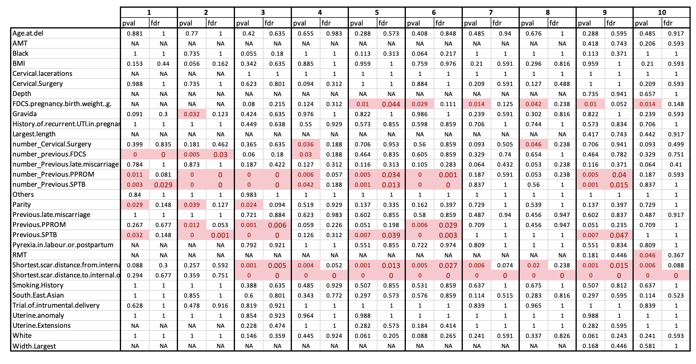

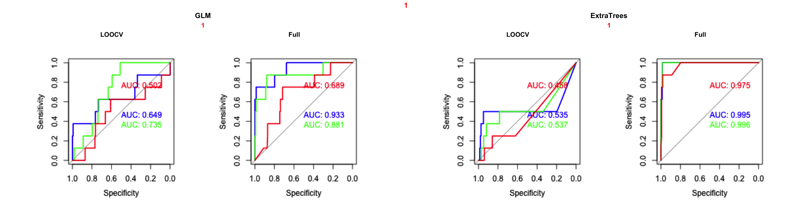
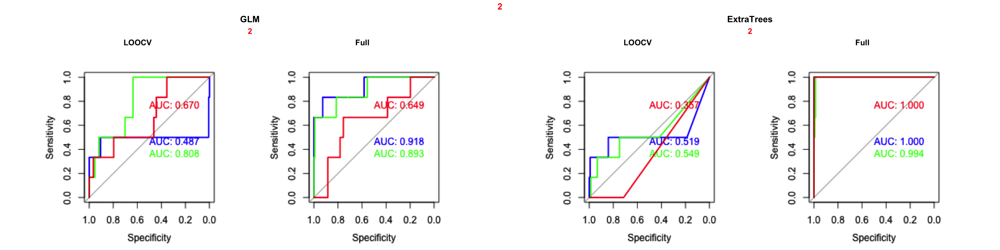
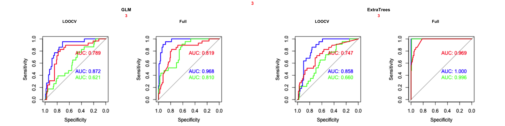
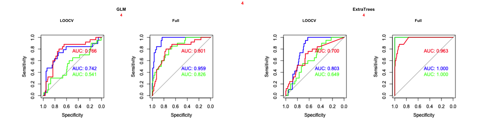
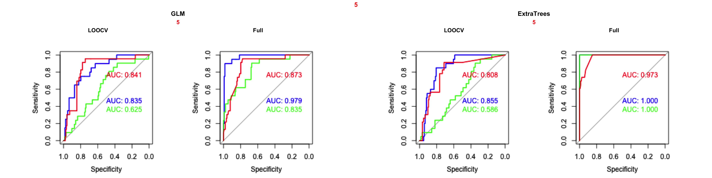
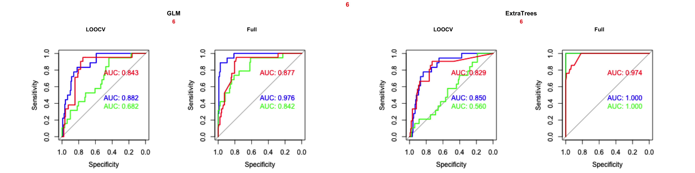
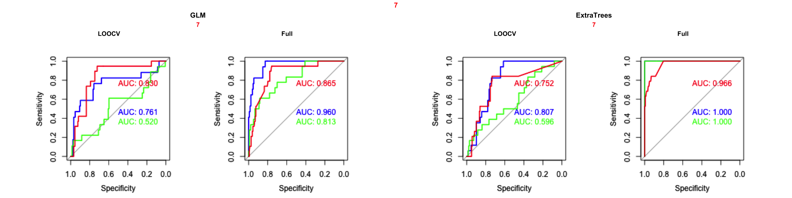
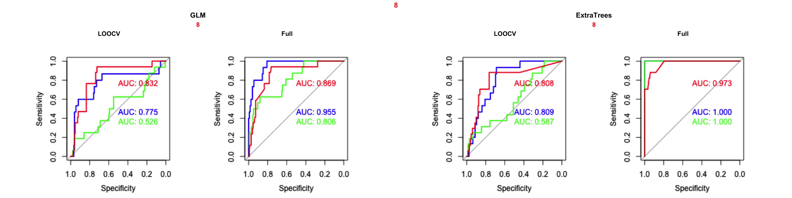
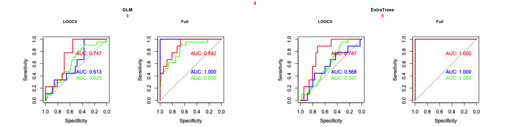
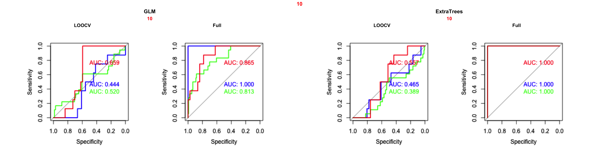

