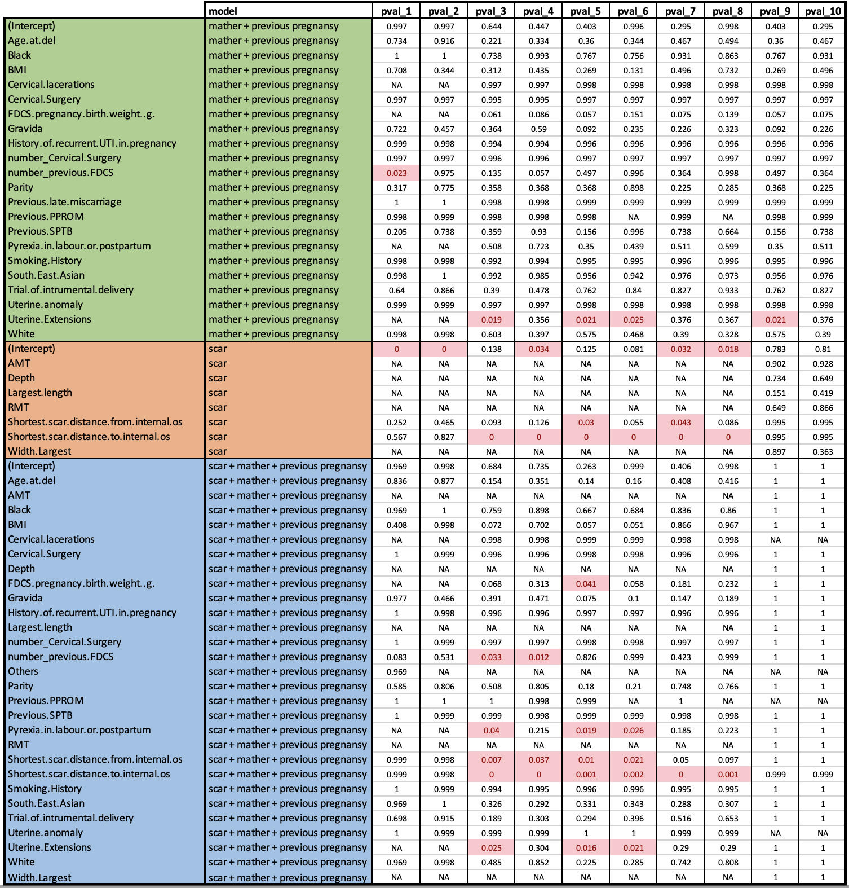

[old page](old.md)

# Data changes
- **Ethnicity** replaced with 4 binary signs: **White**, **Black**,**South.East.Asian** and **Others**
- Excluded: **DOB** and **EDD** (reason: we have age for previous pregnancy)
- All signs like *???weeks* and *???days* were changed to *???all_days* (=*???weeks*\*7 + *???days*) (for 
**Fetal.fibronectin.test.gestation**,**Gestation.at.delivery*, **Scar.measurement.gestation**, **Gestation.Cervical.length.Shortest**)
- Excluded: **Duration.of.2nd.stage..MIN.**, **Duration.of.active.second.stage..MIN.**, 
**Largest.length**,**Depth**, **Width.Largest**, **RMT**, **AMT**  (reason: a lot of missing values (more than 50%))

# Table of signs

# Models
- P1 ~ f1 (*model for prediction Preterm.birth.Intervention based on f1 signs*)
- P1 ~ f2 (*model for prediction Preterm.birth.Intervention based on f2 signs*)
- P1 ~ f3 (*model for prediction Preterm.birth.Intervention based on f3 signs*)
- P2 ~ f1 (*model for prediction Cervical.length_binary based on f1 signs*)
- P2 ~ f2 (*model for prediction Cervical.length_binary based on f2 signs*)
- P2 ~ f3 (*model for prediction Cervical.length_binary based on f3 signs*)

## Procedure:
1. Exclude samples with missing values:
- P1 ~ f1 (*Excluded: 41 samples, rest: 0 - 124,1 - 20)
- P1 ~ f2 (*Excluded: 53 samples, rest: 0 - 113,1 - 19)
- P1 ~ f3 (*Excluded: 20 samples, rest: 0 - 143,1 - 22)
- P2 ~ f1 (*Excluded: 41 samples, rest: 0 - 122,1 - 22)
- P2 ~ f2 (*Excluded: 53 samples, rest: 0 - 111,1 - 21)
- P2 ~ f3 (*Excluded: 20 samples, rest: 0 - 141,1 - 24)
2. For each model repeated 10 times:
- Randomly split dataset on Train (75%) and Test (25%)
- Using Train set: 
  I. Find the best lamda for Lasso (glmnet, alpha = 1) by crossvalidation (nFold=3)
  II. Train glmnet model with alpha = 1 and the best lamda 
  III. Calculate AUC on Train and Test and plot results
  
# Results:

